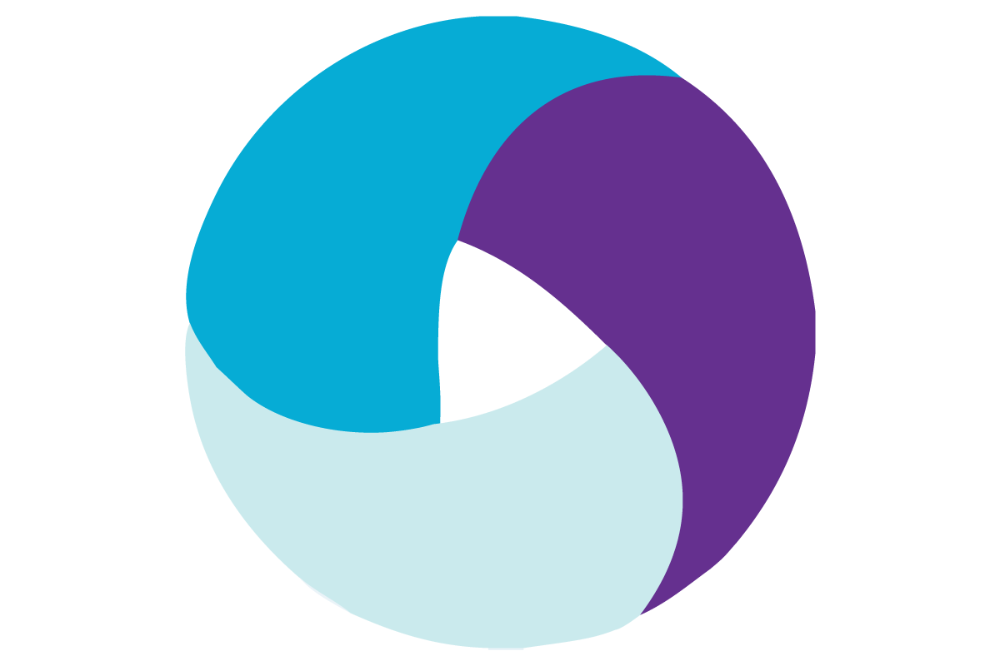

### Hi there 👋
Junior QA Engineer
Graduate of https://qa.guru - QA Automation school, https://github.com/qa-guru

### My projects so far:
+ [UI Testing with PageObjects](https://github.com/Zo1oft/UI_PAgeObjects_Tests)
+ [Mobile](https://github.com/Zo1oft/qa_guru_11_mobile_testing_emulation)
+ [Rest Assured/Lambok/Groovy](https://github.com/Zo1oft/qa_guru_11_API_Groovy_Lambok)

### Stack:

  

 

### My GitHub stats

### Contacts
 
